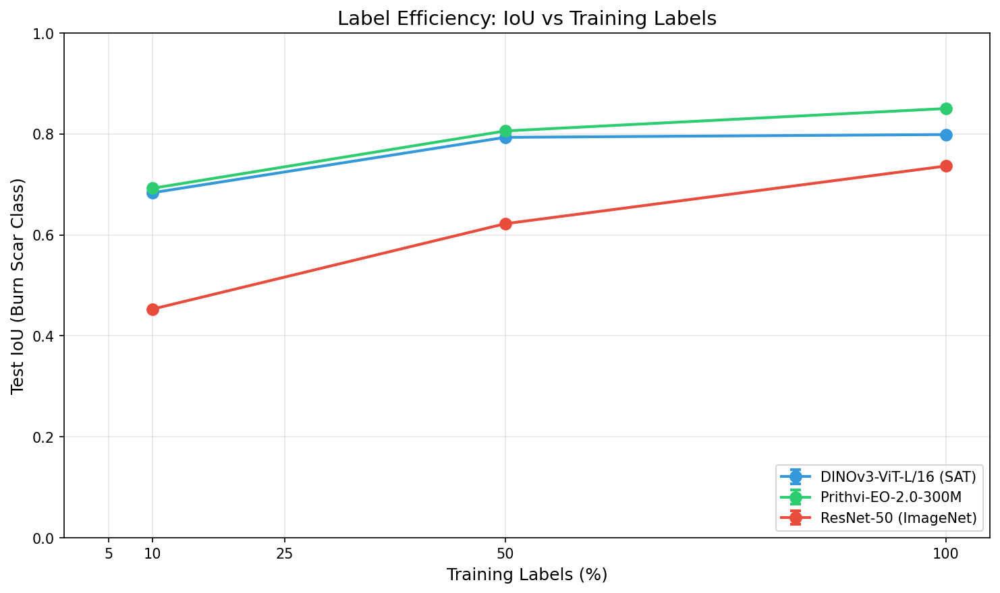

# Burn Scar SSL

Near-supervised burn scar segmentation from 10% labels using semi-supervised learning on NASA HLS satellite imagery. Built as a technical demonstration for blackshark.ai's ORCA HUNTR "train from minimal annotation" value proposition.

## Results at a Glance

**Best model**: Prithvi-EO-v2-300 (324M params) fine-tuned on 100% labels achieves **85.9% IoU** on burn scar detection.

| Method | Labels | Burn Scar IoU | mIoU | Notes |
|--------|--------|---------------|------|-------|
| Full Fine-Tune (Prithvi) | 100% | **85.9%** | 92.1% | Best overall accuracy |
| LoRA r=16 (Prithvi) | 100% | 81.4% | 89.8% | 6.7% trainable params |
| SSL + FixMatch (Prithvi) | 10% | 67.6% | 82.0% | Semi-supervised |
| LoRA r=8 (Prithvi) | 10% | 64.1% | 79.9% | Parameter-efficient |

**Qualitative predictions** across diverse burn scar coverage (0% to 45%+):


**Deployment**: INT8 quantized ONNX model at 373MB (3.3x compression), 22.8ms latency on GPU, with <0.04% IoU loss vs FP32.

| Format | Size | Burn Scar IoU | GPU Latency (p50) |
|--------|------|---------------|-------------------|
| PyTorch FP32 | 1,237 MB | 85.9% | 22.8 ms |
| ONNX FP32 | 1,241 MB | 85.9% | -- |
| ONNX INT8 | 373 MB | 85.8% | -- |

## Approach

This project progresses through 6 phases, each building on the last:

**Phase 1 -- Baseline**: Established the data pipeline for the [HLS Burn Scars](https://huggingface.co/datasets/nasa-impact/hls_burn_scars) dataset (804 tiles, 6 HLS bands, 512x512 px). Built the training loop on TerraTorch with Prithvi-EO-v2-300 as the backbone encoder and a UNet decoder.

**Phase 2 -- Label Efficiency Sweep**: Measured performance at 10%, 25%, 50%, and 100% label fractions to establish the ceiling (100% labels) and floor (10% labels) for the SSL experiments.



**Phase 3 -- Semi-Supervised Learning**: Implemented FixMatch-style consistency regularization with EMA teacher, strong/weak augmentation pairs, and CutMix. At 10% labels, SSL pushes burn scar IoU from the supervised baseline toward the semi-supervised regime.

**Phase 4 -- Parameter-Efficient Fine-Tuning**: Applied LoRA and DoRA adapters to the Prithvi ViT backbone. LoRA r=16 at 100% labels reaches 81.4% burn scar IoU while training only 6.7% of parameters.

**Phase 5 -- Deployment**: Exported models to ONNX with INT8 quantization (3.3x compression). Benchmarked latency across PyTorch/ORT backends and verified accuracy preservation through the export pipeline.

**Phase 6 -- Demo & Documentation**: This interactive demo and the documentation you're reading now.

## Interactive Demo

Launch the demo server to explore predictions on test images or upload your own GeoTIFFs:

```bash
uv run scripts/run_demo.py
```

Open [http://localhost:8000](http://localhost:8000) in your browser. The demo provides:

- A gallery of test images with ground truth overlays
- Drag-and-drop upload for custom 6-band HLS GeoTIFFs
- 4-panel visualization: RGB, Ground Truth, Prediction, Confidence map
- Per-image statistics: burn fraction, mean confidence, inference time

To use a different model:

```bash
uv run scripts/run_demo.py --onnx outputs/phase5/lora_r16/model_fp32.int8.onnx --port 8080
```

## Setup & Reproduction

### Prerequisites

- Python >= 3.12
- [uv](https://docs.astral.sh/uv/) for dependency management
- GPU recommended for training (CUDA)

### Install

```bash
git clone https://github.com/balazsthomay/burn-scar-ssl && cd burn-scar-ssl
uv sync
```

### Download Data

```bash
uv run scripts/download_data.py
```

This downloads the NASA HLS Burn Scars dataset (~3.4 GB) from HuggingFace.

### Training

```bash
# Phase 2: Full fine-tuning sweep
uv run scripts/run_phase2_sweep.py --config configs/phase2_sweep.yaml

# Phase 3: Semi-supervised learning
uv run scripts/run_phase3.py --config configs/phase3_ssl.yaml

# Phase 4: LoRA/DoRA fine-tuning
uv run scripts/run_phase4_peft.py --config configs/phase4_peft.yaml
```

### Export & Benchmark

```bash
# Full pipeline: train + export + benchmark
bash scripts/run_phase5_sweep.sh

# Export only (skip training, use existing checkpoints)
bash scripts/run_phase5_sweep.sh --skip-train
```

### Generate Figures

```bash
uv run scripts/generate_figures.py
# Output: outputs/figures/prediction_grid.png
```

### Run Tests

```bash
uv run pytest                    # all tests (fast)
uv run pytest -m slow            # slow tests (builds Prithvi models)
uv run pytest --cov=src          # with coverage
```

## Project Structure

```
burn-scar-ssl/
├── src/
│   ├── data/
│   │   ├── dataset.py          # HLS Burn Scars datamodule + band statistics
│   │   ├── transforms.py       # Albumentations pipelines (train/val/weak/strong)
│   │   ├── ssl_datamodule.py   # Combined labeled+unlabeled datamodule for SSL
│   │   └── subset_generator.py # Label fraction subset generation
│   ├── models/
│   │   ├── prithvi.py          # Prithvi-EO-v2 ViT backbone via TerraTorch
│   │   ├── segmentation.py     # FPN decoder for custom backbones
│   │   ├── backbone_registry.py
│   │   ├── resnet_backbone.py  # ResNet50 baseline
│   │   └── dinov3_backbone.py  # DINOv3 backbone
│   ├── training/
│   │   ├── trainer.py          # BurnScarSegmentationTask (Lightning)
│   │   ├── ssl_task.py         # FixMatch SSL task with EMA teacher
│   │   └── metrics.py          # Custom segmentation metrics
│   ├── deployment/
│   │   └── export.py           # ONNX export, INT8 quantization, benchmarking
│   └── demo/
│       ├── inference.py        # ONNX inference + PNG visualization
│       ├── app.py              # FastAPI server
│       └── static/index.html   # Frontend
├── scripts/                    # Training, export, and demo launch scripts
├── configs/                    # YAML configurations for each phase
├── tests/                      # 200+ tests, 80%+ coverage
└── data/hls_burn_scars/        # Dataset (not committed)
```

## Dataset

[HLS Burn Scars](https://huggingface.co/datasets/nasa-impact/hls_burn_scars) from NASA IMPACT:

- 804 satellite image tiles (512 x 512 pixels)
- 6 spectral bands: Blue, Green, Red, NIR Narrow, SWIR 1, SWIR 2
- Binary segmentation masks (burn scar vs. background)
- Sourced from Harmonized Landsat Sentinel-2 (HLS) L30 and S30 products
- Covers wildfire events across the western United States (2018-2021)
